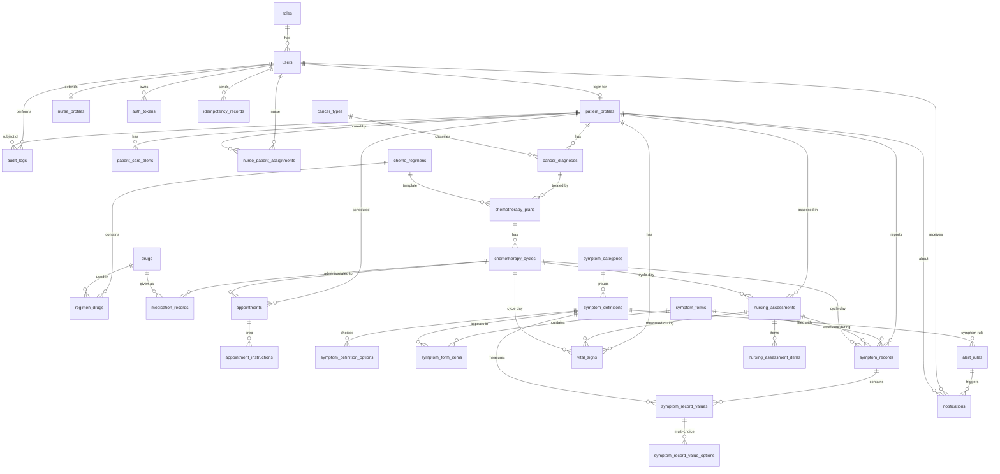
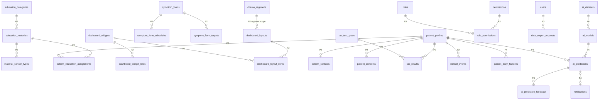

# Cancer Care Platform — Database Design (v3.1)

> 狀態：設計文件；Phase 1 資料表與部分 Phase 2 資料表已實作（見「實作狀態」）
> 更新日期：2026-10-02（病人基本資料 + Email 通知 sprint 同步）
> 目標資料庫：開發 SQLite / 正式 PostgreSQL（僅使用兩者皆支援之型別）
> 相關文件：`docs/api-design.md`（v1.1）、`docs/ui-architecture.md`（v1）

## 實作狀態（2026-10-02）

本文件是完整設計（Phase 1–4）。目前實際存在於 SQLAlchemy Model 與 migration 的只有下列資料表；其餘為設計，尚未實作。

- **Migration**（`backend/migrations/versions/`，依序）：`239714d451b1` 初始 Phase 1 schema → `9253ef8ff76f` 檢驗（`lab_test_types`、`lab_results`、`alert_rules.lab_test_type_id`）→ `ea84e6940c21` 通知處理流程（`notifications.status`、`started_*`、`resolved_*`，`alert_rules.recommended_action`）→ `8c6b981c2152` 病人聯絡 Email 與通知寄送紀錄（`patient_contacts`、`notification_deliveries`）。
- **已實作（36 張）**：`roles`、`users`、`auth_tokens`、`nurse_profiles`、`patient_profiles`、`patient_care_alerts`、`nurse_patient_assignments`、`cancer_types`、`cancer_diagnoses`、`drugs`、`chemo_regimens`、`regimen_drugs`、`chemotherapy_plans`、`chemotherapy_cycles`、`medication_records`、`appointments`、`appointment_instructions`、`symptom_categories`、`symptom_definitions`、`symptom_definition_options`、`symptom_forms`、`symptom_form_items`、`symptom_records`、`symptom_record_values`、`symptom_record_value_options`、`vital_signs`、`nursing_assessments`、`nursing_assessment_items`、`alert_rules`、`notifications`、`lab_test_types`、`lab_results`、`audit_logs`、`idempotency_records`、`patient_contacts`（部分欄位，見下）、`notification_deliveries`。
- **設計中、尚未實作（21 張）**：`permissions`、`role_permissions`、`patient_consents`、`clinical_events`、`symptom_form_schedules`、`symptom_form_targets`、`education_categories`、`education_materials`、`material_cancer_types`、`patient_education_assignments`、`dashboard_widgets`、`dashboard_widget_roles`、`dashboard_layouts`、`dashboard_layout_items`、`institution_settings`、`data_export_requests`、`patient_daily_features`、`ai_datasets`、`ai_models`、`ai_predictions`、`ai_prediction_feedback`。
- **Sprint 7（管理者後台）**：無 schema 變更。沿用 `users.is_active` / `locked_until` / `failed_login_count`（帳號狀態）、`alert_rules`（管理者可改門檻、等級、啟用；`code` / `source_type` / 對象不可改）、`symptom_forms.version` + `symptom_form_items`（題目順序與必填，`version` +1；`symptom_definitions` 不修改）、`audit_logs`（查詢）。既有 `symptom_records` 保留當時的 `form_version`，不重算；既有 `notifications` 不因規則變更而重算。`institution_settings` 仍為設計（設定來自設定檔，唯讀）。
- **Sprint 8（手動 / 排程提醒）**：無 schema 變更。提醒為 `notifications`（`type = reminder`、`recipient_id` = 病人帳號、`event_key = reminder:<uuid>`、`status` 走同一處理流程）；`scheduled_for` 未到前不顯示給病人；`origin`（manual / scheduled / alert_rule）由 `alert_rule_id`、`scheduled_for`、`source_table` 推得，不存欄位；建立者記錄在 `audit_logs`（`CREATE notifications`）。取消排程提醒需新欄位（未規劃）→ 未實作。
- **Authentication Hardening**：無 schema 變更。`auth_tokens` 依設計使用：一次登入 = 一個 `family_id`（session），`token_type = refresh`，只存 `token_hash`（SHA-256），`expires_at` 14 天，`ip_address` / `user_agent` 記錄登入裝置；撤銷 = 設定該 family 所有列的 `revoked_at`。access token 的 `sid` claim 對應 `family_id`。`token_type = password_reset` 尚未使用（公開的密碼重設需要寄送管道）。Refresh（`POST /auth/refresh`）：出示的列標記 `used_at`，同一 `family_id` 新增一列（`expires_at` 沿用，session 最長 14 天）；已標記 `used_at` 的列再次出現 → 整個 family `revoked_at`。原始 token 只存在 HttpOnly cookie。`auth_tokens.family_id` 目前沒有索引（每次 API 請求會依 `user_id` + `family_id` 查詢；資料量大時建議新增索引 migration）。
- **病人基本資料 + Email 通知（2026-10-02）**：migration `8c6b981c2152`，只新增兩張表，不修改既有資料表。
  - `patient_contacts`（Phase 2 表提前建立，**只建 Email 相關欄位**：`email`、`email_verified_at`、`email_notification_enabled`；`phone` / `address` / 病歷號 / 緊急聯絡人仍為 Phase 2）。這是病人自己維護的**通知 Email，與登入帳號 `users.email` 分開**（`users.email` 不因此修改）。`email_verified` 由 `email_verified_at` 推得，不另存欄位。
  - `notification_deliveries`（新表，原設計沒有）：通知經外部管道（Phase 1：email）寄送的紀錄，有自己的 `status`（`pending` / `sent` / `failed` / `skipped`），**與 `notifications.status` 處理流程完全分開**。
  - Email 驗證連結使用既有 `auth_tokens`（`token_type = email_verification`、只存雜湊、24 小時、`used_at` 一次性；更換 Email 或重寄時舊的列設定 `revoked_at`），無 schema 變更。
  - 身高沿用 `patient_profiles.height_cm`；體重沿用 `vital_signs.weight_kg`（病人自行輸入：`source = patient_app`、`recorded_by` = 病人帳號，append-only 保留歷史）；**BMI 不存 DB**（最新體重 ÷ 身高² 即時計算）。
- 一致性：`flask --app run db check` 無差異；由 migration 建立的資料庫與 `db.create_all()` 逐欄比對（欄位、預設值、索引、唯一鍵、外鍵）完全相同。

## 變更摘要（v3 → v3.1）

| 項目 | 變更 |
|---|---|
| 分期重整 | 依決策重排：Phase 1 MVP（32 張）/ Phase 2 Extension（15 張）/ Phase 3 機構設定與進階管理（4 張）/ **Phase 4 AI**（5 張，原 Phase 3） |
| 新增：治療行程 | `appointments`、`appointment_instructions`（Phase 1） |
| 新增：病人注意事項 | `patient_care_alerts`（Phase 1，病人安全資訊，屬 Patient 範圍） |
| 新增：Idempotency Record | `idempotency_records`（Phase 1），取代 API v1 提出的「觀察類表加 `client_request_id`」方案 |
| 新增：主治醫師 | `chemotherapy_plans.attending_physician_name` |
| 提前：通知 | `alert_rules`、`notifications` 由 Phase 2 → **Phase 1** |
| Phase 2 | 衛教教材、問卷排程（新增 `symptom_form_schedules`）、進階 Dashboard 配置（`dashboard_layouts` 增加 `regimen` scope） |
| Phase 3 | 新增 `institution_settings`（機構設定）、`permissions` / `role_permissions` / `data_export_requests`（進階管理） |
| Phase 1 設定來源 | 機構名稱、聯絡專線、生命徵象門檻等在 Phase 1 **由後端設定檔提供**，Phase 3 才改存 DB |
| Dashboard | Phase 1 無資料表；版面由程式定義，並透過 `GET /api/v1/dashboard/layout` 輸出 JSON（契約與 Phase 2 相同） |

---

## 1. 分期總覽（57 張）

### Phase 1 MVP（33 張）

| 決策項目 | 領域 | Tables | 數量 |
|---|---|---|---|
| User、Role | A 帳號與認證 | roles, users, nurse_profiles, auth_tokens | 4 |
| Audit Log、Idempotency Record | B 稽核與請求控制 | audit_logs, idempotency_records | 2 |
| Patient | C 病人 | patient_profiles, patient_care_alerts, nurse_patient_assignments | 3 |
| Cancer Diagnosis | D 診斷 | cancer_types, cancer_diagnoses | 2 |
| Chemotherapy Cycle、Medication Record | E 化療 | drugs, chemo_regimens, regimen_drugs, chemotherapy_plans, chemotherapy_cycles, medication_records | 6 |
| Treatment Schedule | F 治療行程 | appointments, appointment_instructions | 2 |
| Symptom Definition | G 症狀定義 | symptom_categories, symptom_definitions, symptom_definition_options, symptom_forms, symptom_form_items | 5 |
| Symptom Record | H 症狀紀錄 | symptom_records, symptom_record_values, symptom_record_value_options | 3 |
| Vital Signs | I 生命徵象 | vital_signs | 1 |
| Nursing Assessment | J 護理評估 | nursing_assessments, nursing_assessment_items | 2 |
| Notification | K 通知 | alert_rules, notifications, notification_deliveries（2026-10-02 新增） | 3 |

> Chemotherapy Cycle 必須有上層的 `chemotherapy_plans`，Medication Record 必須有 `drugs`；`chemo_regimens` / `regimen_drugs` 是產生 Cycle 排程（週期天數）與致吐風險的參考資料，所以一起放在 Phase 1。

### Phase 2 Extension（15 張）

| 決策項目 | 領域 | Tables | 數量 |
|---|---|---|---|
| Education Material | L 衛教 | education_categories, education_materials, material_cancer_types, patient_education_assignments | 4 |
| Questionnaire Scheduling | M 問卷排程 | symptom_form_schedules, symptom_form_targets | 2 |
| Advanced Dashboard Configuration | N Dashboard 配置 | dashboard_widgets, dashboard_widget_roles, dashboard_layouts, dashboard_layout_items | 4 |
| （沿用 v3 Phase 2） | O 臨床擴充 | patient_contacts（Email 欄位已提前實作）, patient_consents, lab_test_types, lab_results, clinical_events | 5 |

### Phase 3 機構設定與進階管理（4 張）

| 決策項目 | 領域 | Tables | 數量 |
|---|---|---|---|
| Institution Setting | P 機構設定 | institution_settings | 1 |
| Advanced Admin | Q 進階管理 | permissions, role_permissions, data_export_requests | 3 |

### Phase 4 AI（5 張）

| 領域 | Tables | 數量 |
|---|---|---|
| R AI | patient_daily_features, ai_datasets, ai_models, ai_predictions, ai_prediction_feedback | 5 |

> **分期相依性**：FK 只從較晚的 Phase 指向同期或較早的 Phase。**唯一例外**：Phase 2 加入檢驗值時，`alert_rules` 需要新增 `lab_test_type_id` 欄位（一次 ALTER ADD COLUMN，可為 NULL，不影響既有資料）。

### Phase 1 不需要資料表的功能

| 功能 | Phase 1 做法 | 何時改存 DB |
|---|---|---|
| Dashboard 版面 | 後端程式內定義各角色版面，由 `GET /api/v1/dashboard/layout` 輸出 JSON | Phase 2（`dashboard_*`） |
| 機構名稱、科別、聯絡專線、免責文字 | 後端設定檔（例如 `institution.json`，隨部署版本控管） | Phase 3（`institution_settings`） |
| 生命徵象異常門檻 | 後端設定檔 | Phase 3（門檻設定）；風險通知規則 Phase 1 已存在於 `alert_rules` |
| 問卷開放狀態 | Phase 1 的量表**隨時可填**（例如每日自評），沒有開放時段 | Phase 2（`symptom_form_schedules`） |

---

## 2. 共通規範

| 規範 | 內容 |
|---|---|
| Primary Key | `id INTEGER` 自動遞增；純關聯表用複合 PK |
| 對外識別 | `users`、`patient_profiles` 另有 `public_id CHAR(36)` UUID（UQ），API 只暴露這個值 |
| 時間 | 所有表含 `created_at`、`updated_at`（DATETIME, UTC, NOT NULL），下文不再列出；另有說明者除外 |
| 刪除策略 | **主檔 / 設定類**：`deleted_at` 軟刪除；**觀察類**：不刪除，改用 `record_status`（見 §4） |
| FK 刪除 | 臨床資料 `ON DELETE RESTRICT`；只有附屬明細用 CASCADE |
| 列舉值 | `VARCHAR` + 應用層驗證（不用 DB ENUM） |
| JSON | PG 用 JSONB、SQLite 以 TEXT 儲存；只放不需 SQL 條件查詢的設定 / 快照資料 |
| SQLite | 連線時必須 `PRAGMA foreign_keys=ON` |

---

## 3. 隱私與 Demo 資料政策

| 規則 | 說明 |
|---|---|
| **不存身分證** | Schema 中**沒有**身分證欄位；API 收到相關欄位會直接拒絕。正式上線若確有需要，須經隱私影響評估，並另開獨立加密表 |
| **`patient_code`** | 系統產生、無業務含義的代碼（如 `CCP-000123`），用於畫面、報表、匯出與 AI 資料集 |
| 姓名 | `display_name`：Demo 一律使用假名 |
| 出生日期 | 保留（AI 年齡特徵），Demo 使用合成資料 |
| 直接識別資料隔離 | 電話、地址、緊急聯絡人、病歷號放在 Phase 2 `patient_contacts` |
| Demo 標記 | `patient_profiles.is_demo` |
| Demo 帳號 | 使用 `@demo.local` 等不可投遞網域 |
| 通知 Email（2026-10-02） | 病人自行填寫的通知 Email 存在 `patient_contacts`（與登入帳號 `users.email` 分開、與 `patient_profiles` 隔離）；必須驗證後且病人開啟 Email 通知才寄信。護理師 / 管理者只看到遮罩（`j***@example.com`）；`audit_logs` 只記欄位名稱，`notification_deliveries` 只存遮罩後地址。Email 只寄**摘要**（「您有一則來自護理團隊的新通知」），不含通知標題與內容。正式寄送使用 Brevo（`EMAIL_PROVIDER=brevo`，2026-10-03 實作）；未設定時為 `disabled`，不寄任何信。服務商回應與 API key 不寫入任何資料表 |
| Idempotency | `idempotency_records` **不存 response body**，只存資源指標，避免複製一份醫療資料 |
| AI 資料集 | 只引用 `patient_id` / `patient_code`；正式資料需有 `patient_consents` 同意紀錄 |

---

## 4. 時間序列設計原則（為 AI 保留）

適用的**觀察類資料表**：`vital_signs`、`symptom_records`（含 values）、`nursing_assessments`、`medication_records`（Phase 1），以及 `lab_results`、`clinical_events`（Phase 2）。

| # | 原則 | 做法 |
|---|---|---|
| 1 | Append-only | 送出後不 UPDATE 量測值；更正時新增一筆，用 `amends_id` 指回原紀錄，原紀錄變成 `amended`；輸入錯誤標 `entered_in_error`；不刪除 |
| 2 | 兩種時間 | 臨床時間（`measured_at` / `recorded_at` / `assessed_at` / `administered_at`）是 AI 時間軸；`created_at` 是輸入時間 |

> **照護時間軸（Patient Care Timeline sprint）**：`GET /api/v1/patients/{pid}/timeline` 直接由上述臨床時間組合（加上 `lab_results.collected_at`、`notifications.created_at` 與處理流程的 `acknowledged_at` / `started_at` / `resolved_at`、`chemotherapy_cycles.actual_start_date / actual_end_date`），**不建立時間軸資料表**，也沒有新增 migration。
| 3 | 療程相對時間 | 每筆帶 `cycle_id` + `cycle_day`（該 Cycle 實際開始日 = Day 1），寫入時由伺服器計算。**實作（Sprint 2）：不重算既有紀錄**——開始新 Cycle 後，之後寫入的紀錄才屬於新 Cycle；已開始的 Cycle 不能修改開始日期 |
| 4 | 固定單位 | 單位寫在欄位名（`_c`、`_bpm`、`_mmhg`、`_kg`），檢驗值另存單位快照 |
| 5 | 量尺版本鎖定 | 症狀定義被引用後，語意欄位即鎖定，以 `supersedes_id` 建新版本 |
| 6 | 資料來源 | `source` + `device_id` |
| 7 | 在地時間 | `patient_profiles.timezone` |
| 8 | 缺值即資訊 | 不以預設值補值 |
| 9 | 索引 | 每張觀察表都有 `(patient_id, <臨床時間>)` 索引 |
| 10 | 結果標籤 | Phase 2 `clinical_events`（建議越早收集越好） |
| 11 | 不重複 | 弱網路重送由 `idempotency_records` 攔截，避免重複的觀察紀錄污染時間序列 |

> **實作狀態（Sprint 5）**：症狀紀錄、生命徵象、檢驗結果的更正（`amend`）與標示錯誤（`mark-error`）已實作，遵守 append-only：新紀錄以 `amends_id` 指回原紀錄，原紀錄改為 `amended` / `entered_in_error`，保留原 Cycle 與 `cycle_day`；原因、操作者與時間記在 `audit_logs`。沒有新增 migration。

**觀察共通欄位**（下文以此名稱引用）：

| 欄位 | 型別 | 約束 | 說明 |
|---|---|---|---|
| cycle_id | INTEGER | **FK → chemotherapy_cycles.id**, NULL 可, SET NULL | |
| cycle_day | SMALLINT | | Day 1 = 該 Cycle 實際開始日；Cycle 外為 NULL |
| source | VARCHAR(20) | NOT NULL | `patient_app` / `nurse` / `device` / `import` |
| record_status | VARCHAR(20) | NOT NULL, 預設 `final` | `final` / `amended` / `entered_in_error` |
| amends_id | INTEGER | **FK → 本表.id**, NULL 可 | 此筆更正的是哪一筆 |

---

## 5. ER Diagram

### 5.1 Phase 1 MVP

### 5.2 Phase 2 – 4（只畫新增部分）

---

## 6. Phase 1 MVP — 欄位設計

### A. 帳號與認證

#### `roles`
| 欄位 | 型別 | 約束 | 說明 |
|---|---|---|---|
| id | INTEGER | **PK** | |
| name | VARCHAR(20) | UQ, NOT NULL | `patient` / `nurse` / `admin` |
| description | VARCHAR(255) | | |

#### `users`
| 欄位 | 型別 | 約束 | 說明 |
|---|---|---|---|
| id | INTEGER | **PK** | |
| public_id | CHAR(36) | UQ, NOT NULL | UUID |
| role_id | INTEGER | **FK → roles.id**, NOT NULL | |
| email | VARCHAR(255) | UQ, NOT NULL | Demo 用 `@demo.local` |
| password_hash | VARCHAR(255) | NOT NULL | bcrypt / argon2 |
| display_name | VARCHAR(100) | NOT NULL | |
| is_active | BOOLEAN | NOT NULL, 預設 true | |
| last_login_at | DATETIME | | |
| failed_login_count | INTEGER | 預設 0 | |
| locked_until | DATETIME | | |
| password_changed_at | DATETIME | | |

#### `nurse_profiles`
| 欄位 | 型別 | 約束 | 說明 |
|---|---|---|---|
| id | INTEGER | **PK** | |
| user_id | INTEGER | **FK → users.id**, UQ, NOT NULL, CASCADE | 1:1 |
| staff_code | VARCHAR(30) | UQ | 員工代碼 |
| department | VARCHAR(100) | | |
| title | VARCHAR(50) | | |

#### `auth_tokens`
| 欄位 | 型別 | 約束 | 說明 |
|---|---|---|---|
| id | INTEGER | **PK** | |
| user_id | INTEGER | **FK → users.id**, NOT NULL, CASCADE | |
| token_type | VARCHAR(20) | NOT NULL | `refresh` / `password_reset` / `email_verification`（通知 Email 驗證連結，2026-10-02） |
| token_hash | VARCHAR(255) | UQ, NOT NULL | |
| family_id | CHAR(36) | NOT NULL | 同一登入階段的 refresh token 屬於同一個 family；偵測到重複使用時整個 family 撤銷 |
| expires_at | DATETIME | NOT NULL | |
| revoked_at | DATETIME | | |
| used_at | DATETIME | | |
| ip_address | VARCHAR(45) | | |
| user_agent | VARCHAR(255) | | |

---

### B. 稽核與請求控制

#### `audit_logs`（append-only）
| 欄位 | 型別 | 約束 | 說明 |
|---|---|---|---|
| id | INTEGER（PG: BIGINT） | **PK** | |
| occurred_at | DATETIME | NOT NULL | 本表**沒有** `updated_at` |
| actor_user_id | INTEGER | **FK → users.id**, NULL 可 | |
| actor_role | VARCHAR(20) | | 角色快照 |
| actor_identifier | VARCHAR(255) | | 登入失敗時嘗試的帳號 |
| category | VARCHAR(20) | NOT NULL | `auth` / `data` / `access` / `admin` / `export` |
| action | VARCHAR(30) | NOT NULL | `LOGIN` / `LOGIN_FAILED` / `LOGOUT` / `CREATE` / `UPDATE` / `AMEND` / `MARK_ERROR` / `DELETE` / `VIEW` / `EXPORT` / `PERMISSION_DENIED` / `ASSIGN` / `SIGN` / `ACKNOWLEDGE` |
| resource_type | VARCHAR(50) | | |
| resource_id | VARCHAR(50) | | |
| patient_id | INTEGER | **FK → patient_profiles.id**, NULL 可 | |
| changes | JSON | | 只記差異欄位；敏感欄位遮罩 |
| outcome | VARCHAR(10) | NOT NULL | `success` / `failure` |
| reason | VARCHAR(255) | | |
| request_id | CHAR(36) | | |
| http_method | VARCHAR(10) | | |
| endpoint | VARCHAR(255) | | |
| ip_address | VARCHAR(45) | | |
| user_agent | VARCHAR(255) | | |
| prev_hash / row_hash | CHAR(64) | | 預留：雜湊鏈防竄改 |

**Index**：`(patient_id, occurred_at)`、`(actor_user_id, occurred_at)`、`(resource_type, resource_id)`、`(action, occurred_at)`

#### `idempotency_records`
防止弱網路或重複點擊造成重複寫入。API 會在寫入請求（觀察類 POST、`/amend`、護理評估、給藥紀錄）接受 `Idempotency-Key` header。

| 欄位 | 型別 | 約束 | 說明 |
|---|---|---|---|
| id | INTEGER | **PK** | |
| user_id | INTEGER | **FK → users.id**, NOT NULL, CASCADE | key 以使用者為範圍，不同使用者可以用相同的 key |
| idempotency_key | VARCHAR(64) | NOT NULL | 前端產生的 UUID |
| http_method | VARCHAR(10) | NOT NULL | |
| endpoint | VARCHAR(255) | NOT NULL | 正規化後的路徑，如 `/api/v1/vital-signs` |
| request_hash | CHAR(64) | NOT NULL | 正規化後 request body 的 SHA-256 |
| status | VARCHAR(20) | NOT NULL | `processing` / `completed` / `failed` |
| response_status | SMALLINT | | 第一次處理的 HTTP status |
| resource_type | VARCHAR(50) | | 建立的資源，如 `vital_signs` |
| resource_id | VARCHAR(50) | | 重送時依此重新讀取資源並回傳 |
| error_code | VARCHAR(50) | | 第一次失敗時的錯誤碼（4xx 會照樣重播；5xx 允許重試） |
| completed_at | DATETIME | | |
| expires_at | DATETIME | NOT NULL | 建立後 24 小時；過期資料由排程清除 |
| | | UQ(user_id, idempotency_key) | |

**Index**：`(expires_at)`（清除用）

**處理規則**

| 情境 | 行為 |
|---|---|
| 新的 key | 在 business transaction **開始前**插入 `processing`，完成後在同一個 transaction 內更新為 `completed` 並寫入資源指標 |
| 相同 key + 相同 `request_hash` + `completed` | 不重新執行；依 `resource_type/id` 讀取目前資源並回傳原本的 status，並加上 header `Idempotent-Replayed: true` |
| 相同 key + 不同 `request_hash` | `422 IDEMPOTENCY_KEY_MISMATCH` |
| 相同 key + `processing` | `409 IDEMPOTENCY_IN_PROGRESS`（前端稍後重試） |
| 第一次 5xx | 標記 `failed`，允許以相同 key 重試 |

> 不存 response body：避免在這張表複製一份病人資料，也不需要額外的存取控管。

---

### C. 病人

#### `patient_profiles`
| 欄位 | 型別 | 約束 | 說明 |
|---|---|---|---|
| id | INTEGER | **PK** | |
| public_id | CHAR(36) | UQ, NOT NULL | UUID |
| patient_code | VARCHAR(20) | UQ, NOT NULL | 系統產生，如 `CCP-000123` |
| user_id | INTEGER | **FK → users.id**, UQ, NULL 可, SET NULL | 1:1 |
| display_name | VARCHAR(100) | NOT NULL | Demo 使用假名 |
| gender | VARCHAR(10) | | `male` / `female` / `other` |
| date_of_birth | DATE | NOT NULL | Demo 為合成資料 |
| height_cm | DECIMAL(5,1) | | |
| blood_type | VARCHAR(5) | | |
| allergies | TEXT | | 自由文字補充；需要固定顯示的過敏請另建 `patient_care_alerts` |
| baseline_ecog | SMALLINT | 0–5 | |
| timezone | VARCHAR(40) | NOT NULL, 預設 `Asia/Taipei` | |
| is_demo | BOOLEAN | NOT NULL, 預設 true | |
| created_by | INTEGER | **FK → users.id** | |
| deleted_at | DATETIME | | |

#### `patient_care_alerts`
病人安全注意事項，固定顯示在病人摘要卡 / 護理端 Banner。

| 欄位 | 型別 | 約束 | 說明 |
|---|---|---|---|
| id | INTEGER | **PK** | |
| patient_id | INTEGER | **FK → patient_profiles.id**, NOT NULL | |
| alert_type | VARCHAR(30) | NOT NULL | `allergy` / `limb_restriction` / `fall_risk` / `isolation` / `other` |
| body_site | VARCHAR(30) | | `right_arm` / `left_arm` …（肢體限制用） |
| description | VARCHAR(255) | NOT NULL | 如「右手禁止注射及量血壓」 |
| severity | VARCHAR(10) | NOT NULL | `high` / `medium` / `low` |
| is_active | BOOLEAN | NOT NULL, 預設 true | 停用取代刪除 |
| recorded_by | INTEGER | **FK → users.id** | |

**Index**：`(patient_id, is_active)`

#### `nurse_patient_assignments`
| 欄位 | 型別 | 約束 | 說明 |
|---|---|---|---|
| id | INTEGER | **PK** | |
| nurse_id | INTEGER | **FK → users.id**, NOT NULL | |
| patient_id | INTEGER | **FK → patient_profiles.id**, NOT NULL | |
| is_primary | BOOLEAN | 預設 false | |
| assigned_at | DATETIME | NOT NULL | |
| ended_at | DATETIME | | NULL = 仍負責 |
| assigned_by | INTEGER | **FK → users.id** | |
| | | UQ(nurse_id, patient_id, assigned_at) | |

**Index**：`(nurse_id, ended_at)`、`(patient_id, ended_at)`

---

### D. 診斷

#### `cancer_types`
| 欄位 | 型別 | 約束 | 說明 |
|---|---|---|---|
| id | INTEGER | **PK** | |
| code | VARCHAR(20) | UQ, NOT NULL | ICD-10 |
| name_zh | VARCHAR(100) | NOT NULL | |
| name_en | VARCHAR(100) | | |
| is_active | BOOLEAN | 預設 true | |

#### `cancer_diagnoses`
| 欄位 | 型別 | 約束 | 說明 |
|---|---|---|---|
| id | INTEGER | **PK** | |
| patient_id | INTEGER | **FK → patient_profiles.id**, NOT NULL | |
| cancer_type_id | INTEGER | **FK → cancer_types.id**, NOT NULL | |
| diagnosis_date | DATE | NOT NULL | |
| stage | VARCHAR(10) | | |
| tnm_t / tnm_n / tnm_m | VARCHAR(10) | | |
| histology | VARCHAR(100) | | |
| biomarkers | JSON | | |
| is_primary | BOOLEAN | 預設 true | |
| status | VARCHAR(20) | | `active` / `remission` / `recurrence` |
| notes | TEXT | | |
| created_by | INTEGER | **FK → users.id** | |
| deleted_at | DATETIME | | |

---

### E. 化療

#### `drugs`
| 欄位 | 型別 | 約束 | 說明 |
|---|---|---|---|
| id | INTEGER | **PK** | |
| generic_name | VARCHAR(100) | UQ, NOT NULL | |
| brand_name | VARCHAR(100) | | |
| drug_class | VARCHAR(50) | | |
| default_route | VARCHAR(20) | | `IV` / `PO` / `SC` |
| is_active | BOOLEAN | 預設 true | |

#### `chemo_regimens`
| 欄位 | 型別 | 約束 | 說明 |
|---|---|---|---|
| id | INTEGER | **PK** | |
| name | VARCHAR(50) | UQ, NOT NULL | |
| description | TEXT | | |
| cycle_length_days | SMALLINT | | 產生 Cycle 排程用 |
| default_total_cycles | SMALLINT | | |
| emetogenic_risk | VARCHAR(10) | | |
| is_active | BOOLEAN | 預設 true | |

#### `regimen_drugs`
| 欄位 | 型別 | 約束 | 說明 |
|---|---|---|---|
| id | INTEGER | **PK** | |
| regimen_id | INTEGER | **FK → chemo_regimens.id**, NOT NULL, CASCADE | |
| drug_id | INTEGER | **FK → drugs.id**, NOT NULL | |
| dose_value | DECIMAL(10,2) | | |
| dose_unit | VARCHAR(20) | | |
| route | VARCHAR(20) | | |
| day_of_cycle | VARCHAR(20) | | |
| sequence | SMALLINT | | |
| | | UQ(regimen_id, drug_id, day_of_cycle) | |

#### `chemotherapy_plans`
| 欄位 | 型別 | 約束 | 說明 |
|---|---|---|---|
| id | INTEGER | **PK** | |
| patient_id | INTEGER | **FK → patient_profiles.id**, NOT NULL | 刻意冗餘 |
| diagnosis_id | INTEGER | **FK → cancer_diagnoses.id**, NOT NULL | |
| regimen_id | INTEGER | **FK → chemo_regimens.id**, NULL 可 | |
| plan_name | VARCHAR(100) | | |
| intent | VARCHAR(20) | | |
| line_of_therapy | SMALLINT | | |
| total_cycles | SMALLINT | | |
| start_date | DATE | NOT NULL | |
| end_date | DATE | | |
| status | VARCHAR(20) | NOT NULL | `planned` / `active` / `completed` / `discontinued` |
| discontinue_reason | TEXT | | |
| attending_physician_name | VARCHAR(100) | | **v3.1 新增**；醫師不是系統使用者，Phase 1 以文字記錄 |
| created_by | INTEGER | **FK → users.id** | |
| deleted_at | DATETIME | | |

#### `chemotherapy_cycles`
| 欄位 | 型別 | 約束 | 說明 |
|---|---|---|---|
| id | INTEGER | **PK** | |
| plan_id | INTEGER | **FK → chemotherapy_plans.id**, NOT NULL | |
| patient_id | INTEGER | **FK → patient_profiles.id**, NOT NULL | 刻意冗餘 |
| cycle_number | SMALLINT | NOT NULL | |
| scheduled_date | DATE | NOT NULL | |
| actual_start_date | DATE | | cycle_day 的 Day 1 基準 |
| actual_end_date | DATE | | |
| weight_kg | DECIMAL(5,1) | | |
| bsa_m2 | DECIMAL(4,2) | | |
| dose_modification_pct | SMALLINT | 預設 100 | |
| status | VARCHAR(20) | NOT NULL | `scheduled` / `in_progress` / `completed` / `delayed` / `cancelled` |
| delay_days | SMALLINT | | |
| delay_reason | TEXT | | |
| nadir_start_day / nadir_end_day | SMALLINT | | |
| notes | TEXT | | |
| deleted_at | DATETIME | | |
| | | UQ(plan_id, cycle_number) | |

**Index**：`(patient_id, scheduled_date)`

#### `medication_records`（觀察類）
| 欄位 | 型別 | 約束 | 說明 |
|---|---|---|---|
| id | INTEGER | **PK** | |
| patient_id | INTEGER | **FK → patient_profiles.id**, NOT NULL | |
| drug_id | INTEGER | **FK → drugs.id**, NOT NULL | |
| medication_type | VARCHAR(20) | NOT NULL | `chemo` / `premedication` / `supportive` |
| dose_value | DECIMAL(10,2) | NOT NULL | |
| dose_unit | VARCHAR(20) | NOT NULL | |
| route | VARCHAR(20) | | |
| administered_at | DATETIME | NOT NULL | |
| infusion_duration_min | INTEGER | | |
| administration_status | VARCHAR(20) | NOT NULL | `given` / `held` / `partial` / `refused` |
| reaction_notes | TEXT | | |
| administered_by | INTEGER | **FK → users.id** | |
| *觀察共通欄位* | | | cycle_id（本表 NOT NULL）、cycle_day、source、record_status、amends_id |

**Index**：`(patient_id, administered_at)`、`(cycle_id)`

> **實作狀態（Sprint 2）**：`drugs`、`chemo_regimens`、`regimen_drugs`、`chemotherapy_plans`、`chemotherapy_cycles`、`medication_records` 由 `/api/v1/chemotherapy` 讀寫，沒有新增 migration。更正 / 標示錯誤的原因記在 `audit_logs.changes`（本表沒有 reason 欄位），更正鏈以 `amends_id` 追溯。

---

### F. 治療行程（Treatment Schedule）

化療 Cycle 只有「預定日期」，也不涵蓋抽血、門診、影像檢查。首頁的「今日行程」需要精確時間與檢查前準備，所以另設行程表。

#### `appointments`
| 欄位 | 型別 | 約束 | 說明 |
|---|---|---|---|
| id | INTEGER | **PK** | |
| patient_id | INTEGER | **FK → patient_profiles.id**, NOT NULL | |
| cycle_id | INTEGER | **FK → chemotherapy_cycles.id**, NULL 可, SET NULL | 與某個 Cycle 相關的行程（如化療注射、化療前抽血） |
| appointment_type | VARCHAR(30) | NOT NULL | `chemo_infusion` / `lab_draw` / `clinic_visit` / `imaging` / `radiotherapy` / `education_session` / `other` |
| title | VARCHAR(100) | NOT NULL | |
| scheduled_at | DATETIME | NOT NULL | |
| duration_min | SMALLINT | | |
| location | VARCHAR(100) | | |
| status | VARCHAR(20) | NOT NULL, 預設 `scheduled` | `scheduled` / `checked_in` / `completed` / `cancelled` / `no_show` / `rescheduled` |
| rescheduled_from_id | INTEGER | **FK → appointments.id**, NULL 可 | 改期時建立新行程並指回原行程（保留改期歷史，也可作為 AI 特徵） |
| notes | TEXT | | |
| created_by | INTEGER | **FK → users.id** | |
| deleted_at | DATETIME | | |

**Index**：`(patient_id, scheduled_at)`、`(scheduled_at, status)`（護理端當日清單）

> **實作狀態（Sprint 3）**：`appointments`、`appointment_instructions` 由 `/api/v1/chemotherapy/appointments` 讀寫，沒有新增 migration。改期不修改原行程時間：新增一筆並以 `rescheduled_from_id` 指回，原行程狀態改為 `rescheduled`。報到 / 完成時間不另存欄位（記在 `audit_logs`）。

#### `appointment_instructions`
| 欄位 | 型別 | 約束 | 說明 |
|---|---|---|---|
| id | INTEGER | **PK** | |
| appointment_id | INTEGER | **FK → appointments.id**, NOT NULL, CASCADE | |
| instruction_type | VARCHAR(20) | NOT NULL | `fasting` / `check_in` / `medication` / `bring_item` / `other` |
| due_at | DATETIME | | 如空腹開始時間、報到時間 |
| text | VARCHAR(255) | NOT NULL | |
| is_highlighted | BOOLEAN | 預設 true | 首頁以「需要行動」樣式顯示 |
| display_order | SMALLINT | | |

---

### G. 症狀定義（Symptom Definition）

#### `symptom_categories`
| 欄位 | 型別 | 約束 | 說明 |
|---|---|---|---|
| id | INTEGER | **PK** | |
| code | VARCHAR(30) | UQ, NOT NULL | `general` / `gastrointestinal` / `neurological` / `skin` / `nursing_check` |
| name_zh | VARCHAR(50) | NOT NULL | |
| display_order | SMALLINT | | |

#### `symptom_definitions`
| 欄位 | 型別 | 約束 | 說明 |
|---|---|---|---|
| id | INTEGER | **PK** | |
| code | VARCHAR(50) | UQ, NOT NULL | |
| category_id | INTEGER | **FK → symptom_categories.id** | |
| name_zh | VARCHAR(100) | NOT NULL | |
| name_en | VARCHAR(100) | | |
| question_text | VARCHAR(255) | | |
| help_text | TEXT | | |
| value_type | VARCHAR(20) | NOT NULL | `scale` / `single_choice` / `multi_choice` / `boolean` / `numeric` / `text` |
| min_value / max_value / step | DECIMAL(8,2) | | |
| unit | VARCHAR(20) | | |
| min_label / max_label | VARCHAR(50) | | |
| higher_is_worse | BOOLEAN | NOT NULL, 預設 true | |
| ctcae_term | VARCHAR(100) | | |
| is_system | BOOLEAN | 預設 false | |
| is_active | BOOLEAN | 預設 true | |
| supersedes_id | INTEGER | **FK → symptom_definitions.id**, NULL 可 | |
| created_by | INTEGER | **FK → users.id** | |

> **版本規則**：被引用後 `value_type`、`min/max`、選項分數即鎖定；要變更就建新定義並用 `supersedes_id` 串接。

#### `symptom_definition_options`
| 欄位 | 型別 | 約束 | 說明 |
|---|---|---|---|
| id | INTEGER | **PK** | |
| definition_id | INTEGER | **FK → symptom_definitions.id**, NOT NULL, CASCADE | 被引用時應用層禁止刪除 |
| value_code | VARCHAR(50) | NOT NULL | |
| label_zh | VARCHAR(100) | NOT NULL | |
| score | DECIMAL(6,2) | | |
| display_order | SMALLINT | | |
| is_active | BOOLEAN | 預設 true | |
| | | UQ(definition_id, value_code) | |

#### `symptom_forms`
| 欄位 | 型別 | 約束 | 說明 |
|---|---|---|---|
| id | INTEGER | **PK** | |
| code | VARCHAR(50) | UQ, NOT NULL | |
| name | VARCHAR(100) | NOT NULL | |
| description | TEXT | | |
| intended_for | VARCHAR(20) | NOT NULL | `patient` / `nurse` / `both` |
| recall_period_hours | SMALLINT | | |
| availability | VARCHAR(20) | NOT NULL, 預設 `always` | `always`（Phase 1：隨時可填）/ `scheduled`（Phase 2：依 `symptom_form_schedules` 開放） |
| version | SMALLINT | NOT NULL, 預設 1 | |
| is_active | BOOLEAN | 預設 true | |
| created_by | INTEGER | **FK → users.id** | |

> `availability` 欄位 Phase 1 就先建立，Phase 2 加入排程時不需要修改這張表。

#### `symptom_form_items`
| 欄位 | 型別 | 約束 | 說明 |
|---|---|---|---|
| id | INTEGER | **PK** | |
| form_id | INTEGER | **FK → symptom_forms.id**, NOT NULL, CASCADE | |
| definition_id | INTEGER | **FK → symptom_definitions.id**, NOT NULL | |
| display_order | SMALLINT | NOT NULL | |
| is_required | BOOLEAN | 預設 false | |
| display_condition | JSON | | 欄位預留；條件顯示 Phase 2 實作 |
| | | UQ(form_id, definition_id) | |

---

### H. 症狀紀錄（Symptom Record）

#### `symptom_records`（觀察類）
| 欄位 | 型別 | 約束 | 說明 |
|---|---|---|---|
| id | INTEGER | **PK** | |
| patient_id | INTEGER | **FK → patient_profiles.id**, NOT NULL | |
| form_id | INTEGER | **FK → symptom_forms.id**, NULL 可 | |
| form_version | SMALLINT | | |
| nursing_assessment_id | INTEGER | **FK → nursing_assessments.id**, NULL 可, SET NULL | |
| recorded_at | DATETIME | NOT NULL | |
| reported_by | INTEGER | **FK → users.id**, NOT NULL | |
| review_status | VARCHAR(20) | NOT NULL, 預設 `submitted` | `draft` / `submitted` / `reviewed` |
| notes | TEXT | | |
| reviewed_by | INTEGER | **FK → users.id** | |
| reviewed_at | DATETIME | | |
| *觀察共通欄位* | | | |

**Index**：`(patient_id, recorded_at)`、`(review_status, recorded_at)`

#### `symptom_record_values`
| 欄位 | 型別 | 約束 | 說明 |
|---|---|---|---|
| id | INTEGER | **PK** | |
| symptom_record_id | INTEGER | **FK → symptom_records.id**, NOT NULL, CASCADE | |
| definition_id | INTEGER | **FK → symptom_definitions.id**, NOT NULL | |
| value_numeric | DECIMAL(8,2) | | |
| value_boolean | BOOLEAN | | |
| value_text | TEXT | | |
| option_id | INTEGER | **FK → symptom_definition_options.id** | |
| score | DECIMAL(8,2) | | 正規化分數 |
| ctcae_grade | SMALLINT | 0–5 | |
| body_location | VARCHAR(50) | | |
| | | UQ(symptom_record_id, definition_id) | |

**Index**：`(definition_id, symptom_record_id)`

#### `symptom_record_value_options`
| 欄位 | 型別 | 約束 |
|---|---|---|
| value_id | INTEGER | **PK（複合）**, **FK → symptom_record_values.id**, CASCADE |
| option_id | INTEGER | **PK（複合）**, **FK → symptom_definition_options.id** |

---

### I. 生命徵象

#### `vital_signs`（觀察類）
| 欄位 | 型別 | 約束 | 說明 |
|---|---|---|---|
| id | INTEGER | **PK** | |
| patient_id | INTEGER | **FK → patient_profiles.id**, NOT NULL | |
| nursing_assessment_id | INTEGER | **FK → nursing_assessments.id**, NULL 可, SET NULL | |
| measured_at | DATETIME | NOT NULL | |
| temperature_c | DECIMAL(4,1) | | |
| temperature_site | VARCHAR(10) | | |
| heart_rate_bpm | SMALLINT | | |
| systolic_bp_mmhg / diastolic_bp_mmhg | SMALLINT | | |
| bp_measure_site | VARCHAR(20) | | **v3.1 新增**：`left_arm` / `right_arm` / `leg`；可與 `patient_care_alerts` 的肢體限制交叉檢查 |
| respiratory_rate | SMALLINT | | |
| spo2_pct | SMALLINT | | |
| weight_kg | DECIMAL(5,1) | | |
| pain_score | SMALLINT | 0–10 | |
| device_id | VARCHAR(100) | | |
| recorded_by | INTEGER | **FK → users.id**, NOT NULL | |
| notes | TEXT | | |
| *觀察共通欄位* | | | |

**Index**：`(patient_id, measured_at)`

---

### J. 護理評估

#### `nursing_assessments`（觀察類）
| 欄位 | 型別 | 約束 | 說明 |
|---|---|---|---|
| id | INTEGER | **PK** | |
| patient_id | INTEGER | **FK → patient_profiles.id**, NOT NULL | |
| assessed_by | INTEGER | **FK → users.id**, NOT NULL | |
| assessed_at | DATETIME | NOT NULL | |
| assessment_type | VARCHAR(20) | NOT NULL | `initial` / `pre_chemo` / `during_infusion` / `post_chemo` / `follow_up` / `phone_follow_up` |
| appointment_id | INTEGER | **FK → appointments.id**, NULL 可, SET NULL | **v3.1 新增**：在哪一次行程中進行的評估 |
| ecog_status | SMALLINT | 0–5 | |
| overall_condition | VARCHAR(20) | | `stable` / `concern` / `urgent` |
| risk_level | VARCHAR(10) | | `low` / `medium` / `high` |
| chemo_readiness | VARCHAR(20) | | `ready` / `hold` / `delay` / `refer_physician` |
| subjective / objective / assessment / plan | TEXT | | SOAP |
| next_follow_up_at | DATETIME | | |
| sign_status | VARCHAR(10) | NOT NULL, 預設 `draft` | `draft` / `signed` |
| signed_at | DATETIME | | |
| *觀察共通欄位* | | | |

**Index**：`(patient_id, assessed_at)`、`(assessed_by, assessed_at)`、`(sign_status)`

> **實作狀態（Sprint 4）**：由 `/api/v1/nursing-assessments` 讀寫，沒有新增 migration。已簽署的評估不修改：修正時新增一筆草稿（`amends_id` 指回），簽署後原評估改為 `amended`；修正原因記在 `audit_logs`。Known limitation：Risk Engine 使用最新一筆有效評估（含草稿）的風險（既有定義，未修改）。

#### `nursing_assessment_items`
| 欄位 | 型別 | 約束 | 說明 |
|---|---|---|---|
| id | INTEGER | **PK** | |
| assessment_id | INTEGER | **FK → nursing_assessments.id**, NOT NULL, CASCADE | |
| item_type | VARCHAR(20) | NOT NULL | `problem` / `goal` / `intervention` / `education` / `referral` |
| code | VARCHAR(50) | | |
| description | TEXT | NOT NULL | |
| priority | VARCHAR(10) | | |
| item_status | VARCHAR(20) | NOT NULL, 預設 `open` | `open` / `in_progress` / `resolved` / `done` |
| resolved_at | DATETIME | | |
| display_order | SMALLINT | | |

---

### K. 通知（Phase 1）

#### `alert_rules`
| 欄位 | 型別 | 約束 | 說明 |
|---|---|---|---|
| id | INTEGER | **PK** | |
| code | VARCHAR(50) | UQ, NOT NULL | 如 `suspected_febrile_neutropenia`，種子資料與程式可用 code 引用 |
| name | VARCHAR(100) | NOT NULL | |
| source_type | VARCHAR(20) | NOT NULL | Phase 1：`vital_sign` / `symptom` / `schedule`；Phase 2 加 `lab` |
| vital_field | VARCHAR(50) | | |
| symptom_definition_id | INTEGER | **FK → symptom_definitions.id** | |
| operator | VARCHAR(5) | NOT NULL | |
| threshold_value | DECIMAL(10,3) | NOT NULL | |
| extra_conditions | JSON | | `{"within_nadir":true}`、`{"outside_nadir":true}`、`{"consecutive_records":2}`、`{"value_above":0.5}`（數值須同時大於 X） |
| cancer_type_id | INTEGER | **FK → cancer_types.id**, NULL 可 | |
| severity | VARCHAR(10) | NOT NULL | `info` / `warning` / `critical` |
| message_template | VARCHAR(500) | | |
| recommended_action | VARCHAR(500) | | 給照護人員的建議處理（顯示在通知內容）；migration `ea84e6940c21` 新增 |
| notify_patient / notify_nurse | BOOLEAN | 預設 true | |
| cooldown_minutes | INTEGER | 預設 0 | |
| is_active | BOOLEAN | 預設 true | |

> Phase 2 新增欄位：`lab_test_type_id INTEGER FK → lab_test_types.id NULL`（本設計唯一的跨期 ALTER）。
> **實作狀態**：已提前實作（Lab Result sprint，migration `9253ef8ff76f`，FK `ON DELETE RESTRICT`）；`source_type` 已支援 `lab`。
> `source_type=schedule` 用於行程提醒（例如化療前一天提醒空腹），由排程產生 `notifications`。

#### `notifications`
| 欄位 | 型別 | 約束 | 說明 |
|---|---|---|---|
| id | INTEGER | **PK** | |
| recipient_id | INTEGER | **FK → users.id**, NOT NULL, CASCADE | |
| patient_id | INTEGER | **FK → patient_profiles.id**, SET NULL | |
| alert_rule_id | INTEGER | **FK → alert_rules.id**, SET NULL | |
| event_key | VARCHAR(100) | | 同一事件發給多位收件者時共用，例如 `vital_signs:881:rule:4`；用於「已由他人處理」與冷卻判斷 |
| type | VARCHAR(20) | NOT NULL | `risk_alert` / `reminder` / `system`（Phase 2 加 `education`；Phase 4 加 `ai_alert`） |
| severity | VARCHAR(10) | NOT NULL | |
| title | VARCHAR(200) | NOT NULL | |
| message | TEXT | NOT NULL | |
| source_table | VARCHAR(50) | | |
| source_id | INTEGER | | |
| scheduled_for | DATETIME | | 未來時間的提醒；查詢時只回 `scheduled_for <= now` 的通知，Phase 1 不需要推播排程 |
| sent_at | DATETIME | | |
| is_read | BOOLEAN | 預設 false | |
| read_at | DATETIME | | |
| acknowledged_by | INTEGER | **FK → users.id** | 接手的護理師 |
| acknowledged_at | DATETIME | | 接手時間 |
| status | VARCHAR(20) | NOT NULL, 預設 `new` | `new` / `acknowledged` / `in_progress` / `resolved`；同一 `event_key` 的每一筆狀態相同 |
| started_by | INTEGER | **FK → users.id**, RESTRICT | 開始處理的護理師 |
| started_at | DATETIME | | |
| resolved_by | INTEGER | **FK → users.id**, RESTRICT | 完成處理的護理師 |
| resolved_at | DATETIME | | |
| resolution_note | TEXT | | 內部處理說明，不提供給病人 |

**Index**：`(recipient_id, is_read, created_at)`、`(patient_id, alert_rule_id, created_at)`、`(event_key)`、`(patient_id, status, created_at)`

> **實作狀態**：處理流程欄位（`status`、`started_*`、`resolved_*`）由 Notification Workflow sprint 新增（migration `ea84e6940c21`）。升級前 `acknowledged_at` 有值代表「已處理」，升級時回填為 `resolved`，並把 `acknowledged_*` 複製到 `started_*` / `resolved_*`；升級後 `acknowledged_*` 只代表「接手」。狀態轉換的歷程記在 `audit_logs`。

#### `notification_deliveries`（2026-10-02 新增，已實作）
通知經外部管道寄送的紀錄（Phase 1 只有 email）。**與 `notifications.status` 分開**：Email 失敗不會改變、也不會 rollback 通知；Email 不是第二套狀態機。只有護理師 / 管理者建立的提醒（`POST /notifications`）會規劃 Email；風險警示不寄 Email。

| 欄位 | 型別 | 約束 | 說明 |
|---|---|---|---|
| id | INTEGER | **PK** | |
| notification_id | INTEGER | **FK → notifications.id**, NOT NULL, CASCADE | 附屬明細 |
| channel | VARCHAR(20) | NOT NULL | `email` |
| status | VARCHAR(20) | NOT NULL, 預設 `pending` | `pending`（已規劃、尚未完成；寄送途中程式中斷會停在此狀態）/ `sent` / `failed` / `skipped` |
| skip_reason | VARCHAR(30) | | `scheduled`（排程提醒不寄）/ `not_configured`（沒有 Email 服務）/ `no_email` / `not_verified` / `disabled`（病人關閉 Email 通知） |
| provider | VARCHAR(30) | | `disabled` / `capture`（開發測試）/ `brevo`（2026-10-03）；`provider_message_id` 為 Brevo 的 `messageId` |
| provider_message_id | VARCHAR(255) | | |
| error_code | VARCHAR(50) | | 系統自訂代碼：`TIMEOUT` / `PROVIDER_REJECTED` / `PROVIDER_ERROR`（不存服務商原始回應） |
| recipient_masked | VARCHAR(255) | | 遮罩後地址（不另存完整 Email） |
| attempted_at / completed_at | DATETIME | | |
| created_at / updated_at | DATETIME | | |

| content_category | VARCHAR(30) | | **2026-10-06**：護理師選的通知主題（`schedule` / `preparation` / `medication` / `symptom_followup` / `clinical_other`） |
| email_mode_requested | VARCHAR(10) | | **2026-10-06**：要求的 Email 模式 `none` / `summary` / `full` |
| email_mode | VARCHAR(10) | | **2026-10-06**：實際套用的模式（敏感主題的 `full` → `summary`）；舊資料 NULL = 摘要 |

**Index**：`(notification_id)`、`(status, created_at)`

> **Email 內容分級（2026-10-06，migration `470df9cf2163`）**：只在 `notification_deliveries` 新增上表三個可為 NULL 的欄位，`notifications` 不變。通知主題 `category`：`schedule`（行程與報到）、`preparation`（就診準備）→ 允許 `full`；`medication`（用藥與治療）、`symptom_followup`（症狀與照護追蹤）、`clinical_other`（其他醫療相關）→ 最多 `summary`；未指定 = `clinical_other`。`email_mode`：`none` / `summary` / `full`，未指定 = `summary`。`skip_reason` 新增 `not_requested`（`none`）。
---

## 7. Phase 2 Extension — 欄位設計

### L. 衛教（Education Material）

#### `education_categories`
| 欄位 | 型別 | 約束 |
|---|---|---|
| id | INTEGER | **PK** |
| name | VARCHAR(50) | UQ, NOT NULL |
| display_order | SMALLINT | |

#### `education_materials`
| 欄位 | 型別 | 約束 | 說明 |
|---|---|---|---|
| id | INTEGER | **PK** | |
| code | VARCHAR(50) | UQ | 供照護主題設定引用 |
| category_id | INTEGER | **FK → education_categories.id**, SET NULL | |
| title | VARCHAR(200) | NOT NULL | |
| summary | VARCHAR(500) | | |
| content | TEXT | | Markdown |
| content_type | VARCHAR(20) | | `article` / `video` / `pdf` / `link` |
| media_url | VARCHAR(500) | | |
| related_symptom_definition_id | INTEGER | **FK → symptom_definitions.id**, SET NULL | |
| related_drug_id | INTEGER | **FK → drugs.id**, SET NULL | |
| language | VARCHAR(10) | 預設 `zh-TW` | |
| version | SMALLINT | 預設 1 | |
| is_published | BOOLEAN | 預設 false | |
| published_at | DATETIME | | |
| author_id | INTEGER | **FK → users.id** | |

#### `material_cancer_types`
| 欄位 | 型別 | 約束 |
|---|---|---|
| material_id | INTEGER | **PK（複合）**, **FK → education_materials.id**, CASCADE |
| cancer_type_id | INTEGER | **PK（複合）**, **FK → cancer_types.id**, CASCADE |

#### `patient_education_assignments`
| 欄位 | 型別 | 約束 | 說明 |
|---|---|---|---|
| id | INTEGER | **PK** | |
| patient_id | INTEGER | **FK → patient_profiles.id**, NOT NULL, CASCADE | |
| material_id | INTEGER | **FK → education_materials.id**, NOT NULL, CASCADE | |
| assigned_by | INTEGER | **FK → users.id** | NULL = 系統推薦 |
| assigned_at | DATETIME | NOT NULL | |
| first_viewed_at | DATETIME | | |
| completed_at | DATETIME | | |
| view_count | INTEGER | 預設 0 | |
| | | UQ(patient_id, material_id) | |

---

### M. 問卷排程（Questionnaire Scheduling）

#### `symptom_form_schedules`
| 欄位 | 型別 | 約束 | 說明 |
|---|---|---|---|
| id | INTEGER | **PK** | |
| form_id | INTEGER | **FK → symptom_forms.id**, NOT NULL, CASCADE | 只對 `availability='scheduled'` 的量表生效 |
| anchor | VARCHAR(20) | NOT NULL | `plan_start` / `cycle_start` / `plan_end` |
| cycle_number | SMALLINT | | `anchor=cycle_start` 時指定第幾個 Cycle；NULL = 每個 Cycle |
| offset_start_days | SMALLINT | NOT NULL | 相對錨點的開放起日（0 = 當天） |
| offset_end_days | SMALLINT | NOT NULL | 相對錨點的結束日 |
| label | VARCHAR(50) | NOT NULL | 「療程第三週」 |
| reminder_enabled | BOOLEAN | 預設 true | 開放時自動產生 `notifications`（type=`reminder`） |
| display_order | SMALLINT | | |

> 問卷狀態（`not_open` / `open` / `submitted` / `overdue` / `closed`）不存 DB，由「開放時段 + 該時段內是否已有 `symptom_records`」即時計算。

#### `symptom_form_targets`
| 欄位 | 型別 | 約束 | 說明 |
|---|---|---|---|
| id | INTEGER | **PK** | |
| form_id | INTEGER | **FK → symptom_forms.id**, NOT NULL, CASCADE | |
| cancer_type_id | INTEGER | **FK → cancer_types.id**, NULL 可, CASCADE | |
| regimen_id | INTEGER | **FK → chemo_regimens.id**, NULL 可, CASCADE | |

---

### N. 進階 Dashboard 配置（Advanced Dashboard Configuration）

Phase 2 將 Phase 1 程式內定義的版面搬進 DB，並開放護理師拖拉。**`GET /api/v1/dashboard/layout` 的 JSON 契約不變**。

#### `dashboard_widgets`
| 欄位 | 型別 | 約束 | 說明 |
|---|---|---|---|
| id | INTEGER | **PK** | |
| code | VARCHAR(50) | UQ, NOT NULL | 與 Phase 1 程式內 registry 的 widget code 相同 |
| name | VARCHAR(100) | NOT NULL | |
| description | VARCHAR(255) | | |
| data_endpoint | VARCHAR(255) | NOT NULL | 如 `/api/v1/dashboard/widgets/today-schedule/data` |
| config_schema | JSON | | JSON Schema |
| default_config | JSON | | |
| default_w / default_h | SMALLINT | NOT NULL | |
| min_w / min_h / max_w / max_h | SMALLINT | | |
| version | SMALLINT | 預設 1 | |
| is_active | BOOLEAN | 預設 true | |

#### `dashboard_widget_roles`
| 欄位 | 型別 | 約束 |
|---|---|---|
| widget_id | INTEGER | **PK（複合）**, **FK → dashboard_widgets.id**, CASCADE |
| role_id | INTEGER | **PK（複合）**, **FK → roles.id**, CASCADE |

#### `dashboard_layouts`
| 欄位 | 型別 | 約束 | 說明 |
|---|---|---|---|
| id | INTEGER | **PK** | |
| scope | VARCHAR(10) | NOT NULL | `system` / `role` / `regimen` / `user` |
| role_id | INTEGER | **FK → roles.id**, NULL 可, CASCADE | `scope=role`（以及 `regimen`，限定角色） |
| regimen_id | INTEGER | **FK → chemo_regimens.id**, NULL 可, CASCADE | `scope=regimen` |
| user_id | INTEGER | **FK → users.id**, NULL 可, CASCADE | `scope=user` |
| name | VARCHAR(100) | NOT NULL | |
| is_default | BOOLEAN | 預設 false | |
| grid_columns | SMALLINT | 預設 12 | |
| version | INTEGER | NOT NULL, 預設 1 | 樂觀鎖 |
| created_by | INTEGER | **FK → users.id** | |

> 載入順序：user → regimen → role → system → 程式預設。

#### `dashboard_layout_items`
| 欄位 | 型別 | 約束 | 說明 |
|---|---|---|---|
| id | INTEGER | **PK** | |
| layout_id | INTEGER | **FK → dashboard_layouts.id**, NOT NULL, CASCADE | |
| widget_id | INTEGER | **FK → dashboard_widgets.id**, NOT NULL | |
| instance_key | VARCHAR(36) | NOT NULL | |
| title_override | VARCHAR(100) | | |
| pos_x / pos_y / width / height | SMALLINT | NOT NULL | |
| responsive_positions | JSON | | |
| config | JSON | | |
| is_collapsible / is_removable | BOOLEAN | 預設 true | 病人版面設為不可移除 |
| widget_version | SMALLINT | | |
| | | UQ(layout_id, instance_key) | |

---

### O. 臨床擴充（沿用 v3）

#### `patient_contacts`
| 欄位 | 型別 | 約束 | 說明 |
|---|---|---|---|
| id | INTEGER | **PK** | |
| patient_id | INTEGER | **FK → patient_profiles.id**, UQ, NOT NULL | 1:1 |
| medical_record_number | VARCHAR(30) | UQ | |
| phone | VARCHAR(30) | | 可應用層加密 |
| address | VARCHAR(255) | | 可應用層加密 |
| emergency_contact_name / phone / relation | VARCHAR | | |
| email | VARCHAR(255) | NULL 可 | **已實作（2026-10-02）**：病人自行維護的通知 Email（不是登入帳號），不設 UQ |
| email_verified_at | DATETIME | NULL 可 | **已實作**：驗證完成時間；更換 Email 時清空 |
| email_notification_enabled | BOOLEAN | NOT NULL，預設 false | **已實作**：只有已驗證時才能為 true；更換 Email 時改回 false |

> **實作狀態**：migration `8c6b981c2152` 只建立 `id`、`patient_id`（UQ、RESTRICT）、`email`、`email_verified_at`、`email_notification_enabled`、`created_at` / `updated_at`；其餘欄位 Phase 2 再以 migration 新增。

#### `patient_consents`
| 欄位 | 型別 | 約束 | 說明 |
|---|---|---|---|
| id | INTEGER | **PK** | |
| patient_id | INTEGER | **FK → patient_profiles.id**, NOT NULL | |
| consent_type | VARCHAR(30) | NOT NULL | `terms_of_use` / `data_research` / `ai_analysis` |
| consent_version | VARCHAR(20) | NOT NULL | |
| granted | BOOLEAN | NOT NULL | |
| granted_at / revoked_at | DATETIME | | |
| recorded_by | INTEGER | **FK → users.id** | |

#### `lab_test_types`
| 欄位 | 型別 | 約束 | 說明 |
|---|---|---|---|
| id | INTEGER | **PK** | |
| code | VARCHAR(20) | UQ, NOT NULL | `WBC` / `ANC` / `HGB` / `PLT` … |
| loinc_code | VARCHAR(20) | | |
| name_zh | VARCHAR(100) | NOT NULL | |
| unit | VARCHAR(20) | NOT NULL | |
| ref_low / ref_high / critical_low / critical_high | DECIMAL(10,3) | | |
| display_order | SMALLINT | | |
| is_active | BOOLEAN | 預設 true | |

#### `lab_results`（觀察類）
| 欄位 | 型別 | 約束 | 說明 |
|---|---|---|---|
| id | INTEGER | **PK** | |
| patient_id | INTEGER | **FK → patient_profiles.id**, NOT NULL | |
| lab_test_type_id | INTEGER | **FK → lab_test_types.id**, NOT NULL | |
| collected_at | DATETIME | NOT NULL | |
| resulted_at | DATETIME | | |
| value_numeric | DECIMAL(10,3) | | |
| value_text | VARCHAR(100) | | |
| unit | VARCHAR(20) | | 快照 |
| ref_low / ref_high | DECIMAL(10,3) | | 快照 |
| abnormal_flag | VARCHAR(2) | | |
| recorded_by | INTEGER | **FK → users.id** | |
| *觀察共通欄位* | | | |

**Index**：`(patient_id, lab_test_type_id, collected_at)`

> **實作狀態**：`lab_test_types`、`lab_results` 已依上表提前實作（Lab Result sprint，migration `9253ef8ff76f`）。`abnormal_flag` 值域：`N` / `L` / `H` / `LL` / `HH`。目前啟用 WBC、ANC、HGB、PLT；參考範圍與危急值為示範資料，需臨床確認。

#### `clinical_events`（觀察類）
| 欄位 | 型別 | 約束 | 說明 |
|---|---|---|---|
| id | INTEGER | **PK** | |
| patient_id | INTEGER | **FK → patient_profiles.id**, NOT NULL | |
| event_type | VARCHAR(30) | NOT NULL | `er_visit` / `unplanned_admission` / `febrile_neutropenia` / `infection` / `transfusion` / `dose_reduction` / `treatment_delay` / `treatment_discontinuation` / `death` |
| occurred_at | DATETIME | NOT NULL | |
| ended_at | DATETIME | | |
| ctcae_grade | SMALLINT | 0–5 | |
| related_symptom_definition_id | INTEGER | **FK → symptom_definitions.id**, NULL 可 | |
| description | TEXT | | |
| recorded_by | INTEGER | **FK → users.id** | |
| *觀察共通欄位* | | | |

**Index**：`(patient_id, occurred_at)`、`(event_type, occurred_at)`

---

## 8. Phase 3 機構設定與進階管理 — 欄位設計

### P. 機構設定（Institution Setting）

#### `institution_settings`
| 欄位 | 型別 | 約束 | 說明 |
|---|---|---|---|
| id | INTEGER | **PK** | |
| key | VARCHAR(100) | UQ, NOT NULL | 如 `organization`、`contacts`、`disclaimers`、`vital_thresholds`、`care_topics` |
| value | JSON | NOT NULL | |
| value_schema | JSON | | 驗證用 JSON Schema |
| is_public | BOOLEAN | NOT NULL, 預設 false | 是否可由未登入的 `GET /api/v1/settings/public` 讀取 |
| description | VARCHAR(255) | | |
| version | INTEGER | NOT NULL, 預設 1 | 樂觀鎖；每次修改都寫入 `audit_logs` |
| updated_by | INTEGER | **FK → users.id** | |

> Phase 1–2 的同名設定來自後端設定檔；Phase 3 上線時把設定檔內容匯入本表作為初始值，API 回應格式不變。

### Q. 進階管理（Advanced Admin）

#### `permissions`
| 欄位 | 型別 | 約束 | 說明 |
|---|---|---|---|
| id | INTEGER | **PK** | |
| code | VARCHAR(100) | UQ, NOT NULL | 如 `patient.read`、`symptom_definition.write`、`audit_log.export` |
| description | VARCHAR(255) | | |
| module | VARCHAR(50) | NOT NULL | |

#### `role_permissions`
| 欄位 | 型別 | 約束 |
|---|---|---|
| role_id | INTEGER | **PK（複合）**, **FK → roles.id**, CASCADE |
| permission_id | INTEGER | **PK（複合）**, **FK → permissions.id**, CASCADE |

> Phase 1–2 權限寫在程式內（依角色判斷）；Phase 3 改為細粒度權限，並可新增自訂角色（例如「護理主管」「衛教專員」）。病人資料範圍的限制（只能看被指派的病人）仍由 `nurse_patient_assignments` 決定，不會被權限表取代。

#### `data_export_requests`
| 欄位 | 型別 | 約束 | 說明 |
|---|---|---|---|
| id | INTEGER | **PK** | |
| requested_by | INTEGER | **FK → users.id**, NOT NULL | |
| export_type | VARCHAR(30) | NOT NULL | `audit_logs` / `patient_report` / `research_dataset` |
| parameters | JSON | NOT NULL | 範圍與篩選條件 |
| purpose | VARCHAR(255) | NOT NULL | 匯出目的（必填） |
| status | VARCHAR(20) | NOT NULL | `pending` / `approved` / `rejected` / `processing` / `ready` / `expired` |
| approved_by | INTEGER | **FK → users.id** | 雙人覆核：申請人不能自己核准 |
| approved_at | DATETIME | | |
| file_uri | VARCHAR(500) | | |
| file_sha256 | CHAR(64) | | |
| expires_at | DATETIME | | 下載期限 |
| downloaded_at | DATETIME | | |

---

## 9. Phase 4 AI — 欄位設計

資料流：觀察類資料（`final`）→ `patient_daily_features` → `ai_datasets` → `ai_models` → `ai_predictions` → `ai_prediction_feedback` + `clinical_events` 結果比對。

#### `patient_daily_features`
| 欄位 | 型別 | 約束 | 說明 |
|---|---|---|---|
| id | INTEGER（PG: BIGINT） | **PK** | |
| patient_id | INTEGER | **FK → patient_profiles.id**, NOT NULL | |
| feature_date | DATE | NOT NULL | 在地日期 |
| feature_version | SMALLINT | NOT NULL | |
| cycle_id | INTEGER | **FK → chemotherapy_cycles.id**, NULL 可 | |
| cycle_day | SMALLINT | | |
| days_since_last_infusion | SMALLINT | | |
| temp_max_c / temp_min_c | DECIMAL(4,1) | | |
| hr_mean / hr_max | DECIMAL(5,1) | | |
| sbp_mean / dbp_mean | DECIMAL(5,1) | | |
| spo2_min | SMALLINT | | |
| weight_kg | DECIMAL(5,1) | | |
| weight_change_pct_7d | DECIMAL(5,2) | | |
| symptom_scores | JSON | | |
| symptom_burden_score | DECIMAL(6,2) | | |
| moderate_or_worse_count | SMALLINT | | |
| symptom_report_count / vital_record_count | SMALLINT | | 參與度 |
| missed_appointment_count_30d | SMALLINT | | 來自 `appointments`（v3.1 新增特徵） |
| latest_anc / latest_plt / latest_hgb | DECIMAL(10,3) | | 只取當日以前已出報告的值 |
| missing_flags | JSON | | |
| computed_at | DATETIME | NOT NULL | |
| | | UQ(patient_id, feature_date, feature_version) | |

#### `ai_datasets`
| 欄位 | 型別 | 約束 | 說明 |
|---|---|---|---|
| id | INTEGER | **PK** | |
| name | VARCHAR(100) | UQ, NOT NULL | |
| description | TEXT | | |
| export_request_id | INTEGER | **FK → data_export_requests.id**, NULL 可 | 經 Phase 3 匯出覆核流程產生 |
| cohort_definition / label_definition | JSON | | |
| feature_version | SMALLINT | NOT NULL | |
| date_range_start / date_range_end | DATE | | |
| patient_count / row_count | INTEGER | | |
| is_deidentified | BOOLEAN | NOT NULL, 預設 true | |
| consent_filter_applied | BOOLEAN | NOT NULL | |
| storage_uri | VARCHAR(500) | | |
| file_sha256 | CHAR(64) | | |
| created_by | INTEGER | **FK → users.id** | |

#### `ai_models`
| 欄位 | 型別 | 約束 | 說明 |
|---|---|---|---|
| id | INTEGER | **PK** | |
| name | VARCHAR(100) | NOT NULL | |
| version | VARCHAR(20) | NOT NULL | |
| task | VARCHAR(50) | NOT NULL | |
| algorithm | VARCHAR(50) | | |
| training_dataset_id | INTEGER | **FK → ai_datasets.id** | |
| feature_version | SMALLINT | NOT NULL | |
| horizon_hours | SMALLINT | | |
| metrics | JSON | | |
| intended_use | TEXT | | |
| status | VARCHAR(20) | NOT NULL | `development` / `validation` / `active` / `retired` |
| approved_by | INTEGER | **FK → users.id** | |
| approved_at | DATETIME | | |
| artifact_uri | VARCHAR(500) | | |
| | | UQ(name, version) | |

#### `ai_predictions`
| 欄位 | 型別 | 約束 | 說明 |
|---|---|---|---|
| id | INTEGER（PG: BIGINT） | **PK** | |
| model_id | INTEGER | **FK → ai_models.id**, NOT NULL | |
| patient_id | INTEGER | **FK → patient_profiles.id**, NOT NULL | |
| cycle_id | INTEGER | **FK → chemotherapy_cycles.id**, NULL 可 | |
| cycle_day | SMALLINT | | |
| predicted_at | DATETIME | NOT NULL | |
| window_start / window_end / horizon_end | DATETIME | | |
| score | DECIMAL(6,4) | NOT NULL | |
| risk_level | VARCHAR(10) | NOT NULL | |
| explanation | JSON | | |
| input_features | JSON | | |
| display_status | VARCHAR(20) | NOT NULL | `shown` / `suppressed` / `shadow` |
| notification_id | INTEGER | **FK → notifications.id**, NULL 可, SET NULL | |

**Index**：`(patient_id, predicted_at)`、`(model_id, predicted_at)`

#### `ai_prediction_feedback`
| 欄位 | 型別 | 約束 | 說明 |
|---|---|---|---|
| id | INTEGER | **PK** | |
| prediction_id | INTEGER | **FK → ai_predictions.id**, NOT NULL, CASCADE | |
| reviewer_id | INTEGER | **FK → users.id**, NOT NULL | |
| agreement | VARCHAR(10) | NOT NULL | |
| action_taken | VARCHAR(30) | | |
| comment | TEXT | | |

---

## 10. Foreign Key 總表

| Phase | 子表.欄位 | 父表 | ON DELETE |
|---|---|---|---|
| 1 | users.role_id | roles | RESTRICT |
| 1 | nurse_profiles.user_id、auth_tokens.user_id、idempotency_records.user_id | users | CASCADE |
| 1 | audit_logs.actor_user_id / patient_id | users / patient_profiles | RESTRICT |
| 1 | patient_profiles.user_id | users | SET NULL |
| 1 | patient_care_alerts.patient_id / recorded_by | patient_profiles / users | RESTRICT |
| 1 | nurse_patient_assignments.nurse_id / patient_id / assigned_by | users / patient_profiles / users | RESTRICT |
| 1 | cancer_diagnoses.patient_id / cancer_type_id | patient_profiles / cancer_types | RESTRICT |
| 1 | regimen_drugs.regimen_id / drug_id | chemo_regimens / drugs | CASCADE / RESTRICT |
| 1 | chemotherapy_plans.patient_id / diagnosis_id / regimen_id | patient_profiles / cancer_diagnoses / chemo_regimens | RESTRICT |
| 1 | chemotherapy_cycles.plan_id / patient_id | chemotherapy_plans / patient_profiles | RESTRICT |
| 1 | medication_records.patient_id / drug_id / cycle_id | patient_profiles / drugs / chemotherapy_cycles | RESTRICT |
| 1 | appointments.patient_id / cycle_id / rescheduled_from_id | patient_profiles / chemotherapy_cycles / appointments | RESTRICT / SET NULL / SET NULL |
| 1 | appointment_instructions.appointment_id | appointments | CASCADE |
| 1 | symptom_definitions.category_id / supersedes_id | symptom_categories / symptom_definitions | RESTRICT |
| 1 | symptom_definition_options.definition_id | symptom_definitions | CASCADE |
| 1 | symptom_form_items.form_id / definition_id | symptom_forms / symptom_definitions | CASCADE / RESTRICT |
| 1 | symptom_records.patient_id / form_id / nursing_assessment_id / cycle_id | patient_profiles / symptom_forms / nursing_assessments / chemotherapy_cycles | RESTRICT / RESTRICT / SET NULL / SET NULL |
| 1 | symptom_record_values.symptom_record_id / definition_id / option_id | symptom_records / symptom_definitions / symptom_definition_options | CASCADE / RESTRICT / RESTRICT |
| 1 | symptom_record_value_options.value_id / option_id | symptom_record_values / symptom_definition_options | CASCADE / RESTRICT |
| 1 | vital_signs.patient_id / nursing_assessment_id / cycle_id | patient_profiles / nursing_assessments / chemotherapy_cycles | RESTRICT / SET NULL / SET NULL |
| 1 | nursing_assessments.patient_id / assessed_by / appointment_id / cycle_id | patient_profiles / users / appointments / chemotherapy_cycles | RESTRICT / RESTRICT / SET NULL / SET NULL |
| 1 | nursing_assessment_items.assessment_id | nursing_assessments | CASCADE |
| 1 | alert_rules.symptom_definition_id / cancer_type_id | symptom_definitions / cancer_types | RESTRICT |
| 1 | notifications.recipient_id / patient_id / alert_rule_id | users / patient_profiles / alert_rules | CASCADE / SET NULL / SET NULL |
| 1 | notification_deliveries.notification_id（2026-10-02） | notifications | CASCADE |
| 1 | 觀察類表.amends_id | 本表 | RESTRICT |
| 1 | 各表 created_by / recorded_by / reported_by / reviewed_by / administered_by / acknowledged_by | users | RESTRICT |
| 2 | education_materials.category_id / related_symptom_definition_id / related_drug_id | … | SET NULL |
| 2 | material_cancer_types.*、patient_education_assignments.* | … | CASCADE |
| 2 | symptom_form_schedules.form_id、symptom_form_targets.* | symptom_forms / cancer_types / chemo_regimens | CASCADE |
| 2 | dashboard_widget_roles.*、dashboard_layouts.role_id / regimen_id / user_id、dashboard_layout_items.layout_id | … | CASCADE |
| 2 | dashboard_layout_items.widget_id | dashboard_widgets | RESTRICT |
| 2 | patient_contacts.patient_id（已提前實作）、patient_consents.patient_id | patient_profiles | RESTRICT |
| 2 | lab_results.patient_id / lab_test_type_id / cycle_id | patient_profiles / lab_test_types / chemotherapy_cycles | RESTRICT / RESTRICT / SET NULL |
| 2 | clinical_events.patient_id / related_symptom_definition_id / cycle_id | … | RESTRICT / RESTRICT / SET NULL |
| 2 | **alert_rules.lab_test_type_id**（ALTER 新增） | lab_test_types | RESTRICT |
| 3 | institution_settings.updated_by | users | RESTRICT |
| 3 | role_permissions.* | roles / permissions | CASCADE |
| 3 | data_export_requests.requested_by / approved_by | users | RESTRICT |
| 4 | patient_daily_features.patient_id / cycle_id | patient_profiles / chemotherapy_cycles | CASCADE / SET NULL |
| 4 | ai_datasets.export_request_id | data_export_requests | SET NULL |
| 4 | ai_models.training_dataset_id | ai_datasets | RESTRICT |
| 4 | ai_predictions.model_id / patient_id / cycle_id / notification_id | … | RESTRICT / RESTRICT / SET NULL / SET NULL |
| 4 | ai_prediction_feedback.prediction_id / reviewer_id | ai_predictions / users | CASCADE / RESTRICT |

---

## 11. Table Relationship 說明

| 關係 | 類型 | Phase | 說明 |
|---|---|---|---|
| roles → users | 1:N | 1 | |
| users → patient_profiles / nurse_profiles | 1:1（可選） | 1 | |
| users → idempotency_records | 1:N | 1 | key 以使用者為範圍 |
| patient → care_alerts | 1:N | 1 | 病人安全資訊 |
| nurse ↔ patient | M:N | 1 | 資料權限依據 |
| patient → diagnoses → plans → cycles → medication_records | 1:N 鏈 | 1 | |
| patient → appointments → instructions | 1:N 鏈 | 1 | 治療行程 |
| cycle → appointments | 1:N（可選） | 1 | |
| appointments → appointments（rescheduled_from） | 自我參照 | 1 | 改期歷史 |
| 症狀定義層 | 1:N 鏈 / M:N | 1 | |
| patient → symptom_records → values → value_options | 1:N 鏈 | 1 | |
| patient → vital_signs | 1:N | 1 | |
| patient → nursing_assessments → items | 1:N 鏈 | 1 | |
| nursing_assessment → vital_signs / symptom_records | 1:N（可選） | 1 | |
| appointment → nursing_assessments | 1:N（可選） | 1 | |
| symptom_definitions → alert_rules → notifications ← users | 1:N | 1 | 風險提醒 |
| education ↔ cancer_types / patients | M:N | 2 | |
| forms → schedules / targets | 1:N | 2 | 問卷排程 |
| widgets ↔ roles；layouts → items ← widgets；regimens → layouts | M:N / 1:N | 2 | |
| patient → contacts / consents / lab_results / clinical_events | 1:1 / 1:N | 2 | |
| roles ↔ permissions | M:N | 3 | |
| users → data_export_requests | 1:N | 3 | |
| datasets → models → predictions → feedback | 1:N 鏈 | 4 | |

---

## 12. 核心設計評估（延續）

### 12.1 Audit Log — Phase 1
與業務資料同一個 transaction 寫入；append-only；VIEW 只記病人層級；`changes` 遮罩敏感欄位；新增 `AMEND` / `MARK_ERROR` / `SIGN` / `ACKNOWLEDGE` 等 action。

### 12.2 Idempotency Record — Phase 1（v3.1 新增）
- **為什麼用獨立表，而不是在各觀察表加 `client_request_id`**：一套機制涵蓋所有寫入端點（包括 amend、給藥、護理評估這類會同時建立多筆資料的請求）；觀察表結構維持單純；可以偵測「同一個 key 但內容不同」的錯誤用法；到期即可清除。
- 必要性：病人端在醫院、家中的網路條件不穩定，重複的生命徵象或症狀紀錄會觸發重複通知，也會污染 AI 時間序列。

### 12.3 Dynamic Symptom — Phase 1 定義 + 紀錄；Phase 2 排程
Phase 1 的量表都是 `availability='always'`；Phase 2 加入 `symptom_form_schedules` 後，把量表改為 `scheduled` 即可啟用開放時段，不需要修改 Phase 1 資料表。

### 12.4 Dashboard — Phase 1 動態版面 API，Phase 2 可配置
- Phase 1：版面定義在後端程式內（每個角色一份），由 `GET /api/v1/dashboard/layout` 輸出 JSON；Vue 依 JSON 渲染元件。**沒有拖拉、沒有資料表**。
- Phase 2：版面改存 `dashboard_*`，開放護理師拖拉、管理者設計角色 / 處方版面；JSON 契約不變，前端的渲染器不需要修改。

### 12.5 設定檔 → DB 的漸進策略
Dashboard 版面、機構設定、權限三者採用相同模式：**Phase 1 由程式 / 設定檔提供，API 契約先定好；後期改存 DB 時只換資料來源**。

---

## 13. 對應 backend modules 與 API

| Module | API Prefix | Phase 1 | Phase 2 | Phase 3 | Phase 4 |
|---|---|---|---|---|---|
| `health` | `/api/v1/health` | — | | | |
| `auth` | `/api/v1/auth` | roles, users, nurse_profiles, auth_tokens | | | |
| core（共用） | — | audit_logs, idempotency_records | | | |
| `patient` | `/api/v1/patients` | patient_profiles, patient_care_alerts, nurse_patient_assignments, cancer_types, cancer_diagnoses | patient_contacts, patient_consents, clinical_events | | |
| `chemotherapy` | `/api/v1/chemotherapy` | drugs, chemo_regimens, regimen_drugs, chemotherapy_plans, chemotherapy_cycles, medication_records, appointments, appointment_instructions | | | |
| `symptom` | `/api/v1/symptoms` | symptom_categories, symptom_definitions, symptom_definition_options, symptom_forms, symptom_form_items, symptom_records, symptom_record_values, symptom_record_value_options | symptom_form_schedules, symptom_form_targets, lab_test_types, lab_results | | |
| `vital_signs` | `/api/v1/vital-signs` | vital_signs | | | |
| `nursing` | `/api/v1/nursing-assessments` | nursing_assessments, nursing_assessment_items | | | |
| `notification` | `/api/v1/notifications` | alert_rules, notifications, notification_deliveries | | | |
| `dashboard` | `/api/v1/dashboard` | （程式內版面） | dashboard_* | | |
| `education` | `/api/v1/education` | | education_*, material_cancer_types, patient_education_assignments | | |
| `settings` | `/api/v1/settings` | （設定檔） | | institution_settings | |
| `admin` | `/api/v1/admin` | 基本帳號管理、稽核查詢 | | permissions, role_permissions, data_export_requests | |
| `ai` | `/api/v1/ai` | | | | patient_daily_features, ai_datasets, ai_models, ai_predictions, ai_prediction_feedback |
